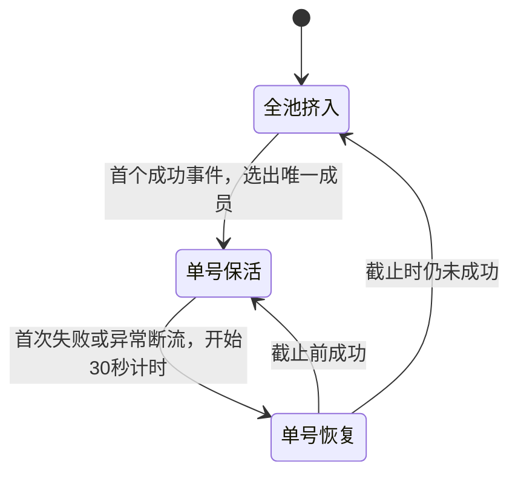

# Key 池任务设计方案

状态：核心行为已由用户确认，功能已实现。日期：2026-09-28。

## 1. 目标与已确认范围

用户选择一批 Key 组成一个任务。启动时全部成员并发挤入，首个成功的 Key 成为唯一保活成员，其他成员停止请求并待命。保活成员中断后独自重新挤入，连续 30 秒未成功则恢复全池竞争；重新竞争时原保活成员也参加。

用户已明确确认以下三项，后续方案据此设计：

| 确认项 | 最终选择 |
| --- | --- |
| 执行端 | 仅 Python 后台池任务，关闭网页继续运行 |
| 中断定义 | 请求失败或成功流异常中断；正常回答结束不算中断 |
| 一直挤不进去 | 对可重试错误持续尝试，直到成功或手动停止 |

池的运行、胜者裁决和 30 秒计时全部由 Python 后台负责，网页负责配置、显示与管理。

## 2. 核心运行规则

将池作为一个任务管理，池内成员不是可独立启动、暂停或保活的普通任务。

| 池状态 | 发起请求的成员 | 转移条件 |
| --- | --- | --- |
| 全池挤入 | 全部可用成员 | 首个成功者成为保活成员 |
| 单号保活 | 只有当前保活成员 | 请求失败或异常断流进入恢复期 |
| 单号恢复 | 只有原保活成员 | 30 秒内成功回到保活；到期未成功恢复全池挤入 |
| 已暂停 | 无 | 用户继续后重新验证原保活成员；没有原保活成员则全池挤入 |
| 已取消／无可用成员 | 无 | 保持停止，不自动重启 |

具体约定：

- 成功沿用现行判定：GPT 的 `response.created` / `response.in_progress`，Claude 的 `message_start`。HTTP 200 本身不足以确认成功。
- 成功事件一到就选出保活成员，不等待完整回答，也不等待其他请求结束。多个成员几乎同时成功，只认调度锁内首先被确认的一位。
- 其他成员立即停止后续发送，并取消正在进行的请求。已经到达上游的请求无法撤回，但不会因此获得保活资格。
- 待命成员不发送探活、保活或定期健康检查；保留自己的会话，下一次全池竞争时复用。
- 所有成员共用任务的模型、提示词、请求间隔、首事件超时和保活间隔。每个成员使用自身 Key、服务地址及独立会话。
- 沿用现有并发参数，但池表单标明为“每个 Key 的探活并发”。若有 N 个可用 Key、每 Key 并发 C，则全池竞争最多同时发起 N × C 个新请求；单号恢复最多 C 个，正常保活始终只有 1 个。
- 至少 2 个不同 Key 组成池；创建时拒绝重复成员，包括不同记录引用相同凭据的情况。
- 池模式固定开启保活，恢复期固定 30 秒，不增加与目标无关的配置开关。池模式持续重试，不显示探活次数上限，也不用超大数字模拟无限次数。

## 3. 30 秒的精确定义

1. 首次确认保活成员失败的时刻为 T0，截止时间为 T0 + 30 秒。无法观测到的上游掉线不能提前计时；请求挂起先按首事件或流超时规则判定失败。
2. 进入恢复期后，原成员按探活间隔及自身 `Retry-After` 重试，其他成员保持待命。后续失败不能重置截止时间。
3. 运行时使用单调时钟；在截止前收到有效成功事件就结束恢复期，重新进入保活。以后再次失败才开始新的 30 秒窗口。
4. 到达截止时间即切换全池竞争。截止检查独立于 HTTP 首事件超时、流读取和旧连接清理；不能因为当前请求仍在等 120 秒超时而延后唤醒其他成员。
5. 切换时使原恢复轮次失效，取消旧请求，启动新的竞争轮次。旧轮次之后到达的成功或失败只能清理自身资源，不能改写当前保活成员或触发通知。
6. 同一个时间边界上先检查截止条件：已到截止点的恢复结果不再作为旧恢复轮次的成功；进入新竞争轮次后重新选胜者。
7. `Retry-After` 按成员记录。全池被唤醒时，不受限的成员立即发起请求；仍在上游指定等待期内的成员到期再参与，不能通过状态切换绕过等待。

示例：A/B/C 同时挤入，B 成功后只有 B 保活。B 在 12:00:00 失败，如果 12:00:20 成功，A/C 全程不发请求；如果截至 12:00:30 仍未成功，A/B/C 重新竞争，下一位胜者可以是任意成员。

## 4. 异常、操作与恢复

- 临时错误：按对应成员的重试间隔处理，不牵连其他可用成员。
- 无效 Key、模型错误、额度不足等现有永久错误：停止该成员在本任务中的请求并显示原因。全池竞争继续使用其余成员；若是保活成员失效，仍按本次 30 秒截止时间唤醒其他成员，期间不重复请求已确认无效的成员。
- 全部成员不可用：停止池并展示各成员原因，不形成空循环。
- 暂停、取消、删除作用于整个池，同时清理请求、调度计时及恢复截止计时；迟到事件不能使池恢复运行。
- 暂停后继续：保留原保活成员时，先给它一次新的 30 秒恢复窗口；没有可用的原保活成员则全池重新竞争。不会补发暂停期间积压请求。
- 池运行期间不编辑成员。需要改变成员集合时停止并重新创建，避免增加热替换流程。
- 删除池引用的 Key：沿用当前“取消关联任务”的语义，取消整个关联池，并在操作提示中明确影响范围。
- 同一池内保证唯一保活成员；不同任务之间不增加全局 Key 租约或账户识别功能。

Python 重启恢复：

| 保存状态 | 恢复行为 |
| --- | --- |
| 全池挤入 | 恢复全体可用成员竞争 |
| 单号保活 | 原成员先进入 30 秒恢复期，验证成功再保活 |
| 单号恢复 | 沿用保存的绝对截止时间；停机时间计入，过期立即全池竞争 |
| 暂停或终态 | 保持停止 |

配置、成员会话、保活成员、阶段、计数与恢复截止时间作为一条池记录保存。运行中的单调时间不直接写入数据库；恢复时由保存的绝对时间换算剩余时长。

## 5. 页面与通知

复用现有新建任务页，增加“普通任务／Key 池任务”选择。池模式显示可搜索的 Key 多选列表、全选与已选数量；模型候选取所选成员模型列表的交集，继续提供现有自定义模型输入。创建失败在对应字段附近显示原因，提交期间展示状态并防止重复提交。

启动摘要显示成员数、每 Key 探活并发、全池最大并发、保活间隔及固定 30 秒恢复规则。池模式固定为 Python 后台调度。

任务中心只显示一张池卡片，包含：

- 当前阶段、成员总数及可用数。
- 当前保活成员的别名与 Key 尾号。
- 恢复期剩余秒数／下次请求时间。
- 请求总数、成功次数、重新全池竞争次数和最近错误。

详情中展示各成员“挤入中／保活／恢复中／待命／不可用”、会话及最近结果。复用现有暂停、继续、取消、删除操作；“立即请求”在保活或恢复阶段仅作用于当前成员，不能重置 30 秒截止时间，在全池阶段作用于全体可请求成员。

倒计时由后台截止时间驱动，前端只负责显示，不负责切换状态。状态使用文字和现有颜色共同表达；阶段改变时提供一条有上下文的辅助技术状态提示，不每秒播报倒计时，也不移动键盘焦点。

通知以池为单位复用当前通知队列、去重及冷却规则。首次挤入或恢复成功只由最终确认的保活成员触发，摘要带成员别名／尾号，其他成员不各发一份通知。

## 6. 实现范围与现有代码约束

当前网页主链路为 `app-shell.ts → store.ts → python-task-engine.ts → server.mjs → python_scheduler.py`。Python 网页适配复用根目录 `codex_tasks.Runtime`，默认同时运行 8 个任务轮次。

实现沿这条链路扩展池任务：

| 位置 | 修改内容 |
| --- | --- |
| `src/core/types.ts`、`task-config.ts` | 明确池配置、池阶段和成员结构，校验多 Key 与共有参数 |
| `src/components/app-shell.ts`、必要的现有样式 | Key 多选、池摘要、阶段与成员详情 |
| `src/core/store.ts`、`src/live/python-task-engine.ts` | 通过现有任务操作入口管理池 |
| `server.mjs` | 创建时读取所有成员的服务器凭据，用现有请求构造器生成各自快照；扩展 Key 删除关联处理 |
| `python_scheduler.py`、`python_pool.py`、`python_transport.py` | 池级胜者裁决、成员请求、30 秒截止、持久化与恢复；共用 HTTP/SSE、错误分类及通知路径 |
| `codex_tasks.py` | 增加由网页池状态机调度的任务识别入口，复用调度锁和并发占位 |
| `tests/local.test.mjs`、必要的 Python 测试 | 本地模拟服务与可控时钟验收 |
| `README.md`、`TECHNICAL.md` | 同步池任务操作与调度规则 |

必须解决的实现点：

- 一个池占一个任务调度单元，其成员在内部展开并发。不能拆成 N 个普通任务，否则超过 8 个成员时无法同轮竞争。
- 当前 `request_round` 会等待所有请求结束才返回；池的胜者选定、截止切换不能被这一等待路径阻塞。请求层与池状态机共享取消和结果通知，不复制另一套 HTTP/SSE 实现。
- 池的状态变更在调度锁内完成，并使用轮次版本排除迟到结果。失效版本仍须释放真实连接和线程资源。
- 当前成功流异常中断仍按成功安排保活；池模式需要将这种情况转为单号恢复，同时保留已成功的历史记录。
- 复用现有任务管理接口和 SQLite 存储方式；不为池再建立独立的 Key 库、通知队列或通用编排框架。
- 实现替换的旧函数、重复分支和废弃资源随修改删除，不增加旧格式兼容或失败后切回旧调度器的路径。

## 7. 验收与实施顺序

第 1 节核心行为已确认；后续实现按以下可独立验证的步骤推进：

1. 配置、池记录及创建接口：成员校验、独立会话、凭据不进入公开任务状态。
2. 全池竞争与唯一胜者：使用超过 8 个成员的本机模拟池验证同轮发起；两个成员几乎同时成功，最终只有一个保活，其他请求被取消且无后续发送。
3. 恢复截止：可控时钟覆盖 29.9 秒成功、30 秒到期、反复失败不延长窗口、请求超时大于 30 秒、迟到成功不得抢回保活资格、每成员 Retry-After；正常流结束继续保活，异常断流进入恢复期。
4. 生命周期：永久失效隔离、全部失效停止、暂停／取消／删除清理、重启保留剩余恢复时间、多个池互不改写胜者。
5. 页面与通知：一张池卡片、成员状态、多选校验、倒计时、一次成功通知及冷却；原有普通任务回归通过。
6. 执行 `npm.cmd run check` 与 `npm.cmd test`，使用本地模拟上游验证，不请求真实模型或发送真实通知。

验证记录：类型检查、普通任务回归、池任务 HTTP 集成测试和可控时钟测试通过；独立 Chrome 验证了 Key 多选、页面创建、刷新恢复、真实 30 秒全池切换，以及关闭浏览器后继续后台保活。Docker 清单与构建白名单已包含新增 Python 模块。
