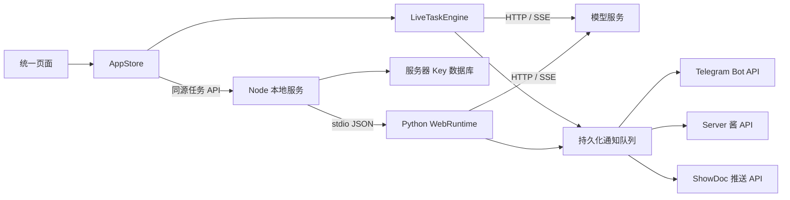

# 双端调度实现

界面源于 2026-09-18 的 AnyRouter 公开前端，当前增加 Python 调度和持续保活，使用同一个任务表单与状态结构。

## 执行链路



AppStore 合并两端任务。ID 与 scheduler 标识执行者，操作路由到拥有该任务的一端。筛选不转移或暂停任务；双端创建产生两个独立任务和会话。

| 模块 | 职责 |
| --- | --- |
| src/core/store.ts | Key、默认设置、任务合并和操作路由 |
| src/core/api-client.ts | 同源 Cookie 请求与登录失效处理 |
| src/components/login-screen.ts | 管理密码登录页 |
| src/core/task-config.ts | 浏览器引擎与服务端共用的任务验证 |
| src/live/live-task-engine.ts | 浏览器探活、并发流、保活和通知 |
| src/live/python-task-engine.ts | Python API 客户端和状态同步 |
| src/live/request-builders.ts | 共用 GPT / Claude 请求构造 |
| python-bridge.mjs | Python 子进程及 stdio 请求响应关联 |
| python_scheduler.py | 根目录 codex_tasks.Runtime 的网页适配、HTTP 轮次和持久化 |
| server.mjs | 登录会话、Key 持久化、静态文件、Python 任务接口和通知队列 |

Python 复用根目录调度器管理轮次、时间、并发占位和修订号；适配层处理并发 HTTP / SSE 及网页状态。根目录终端入口保持独立可用。

构建时将请求构造、验证和 URL 规范化输出至 `dist/task-requests.mjs`。Node 用同一份构造函数为 Python 创建请求快照，GPT / Claude 请求体和工具定义没有另写 Python 版本。

## 请求与调度

接口为 `/v1/models`、`/v1/responses`、`/v1/messages?beta=true`。Base URL 支持服务根地址或 `/v1`，拒绝用户名密码、查询参数及具体接口地址。

Python 鉴权和模型请求统一使用 urllib 的系统代理规则，支持 HTTP_PROXY、HTTPS_PROXY 和 NO_PROXY。模型请求保留连接取消及首事件超时控制。

GPT 头部与请求体见 `codex-contract.ts`，Claude 请求及 26 个工具定义见 `claude-contract.ts` 与 `contracts/claude-code-2.1.231-tools.json`。工具定义仅作为协议数据发送，不在本机执行。

每个任务保持独立 sessionId，用于请求头、GPT client_metadata 和 prompt_cache_key；暂停、继续、保活均保留会话。重新开始创建新的任务和会话。

成功判定统一为 GPT `response.created` / `response.in_progress`、Claude `message_start`；HTTP 200 本身不足以确认成功。

```text
探活：running → requesting → waiting → requesting
成功：requesting → accepted-streaming → keepalive → requesting
保活失败：requesting → waiting → 重新探活
关闭保活：accepted-streaming → accepted-completed / accepted-stream-interrupted
暂停：paused；其他终态：exhausted / cancelled
```

healthy 保存最近轮次是否成功；attemptsMade 是累计实际请求数，probeAttempts 是当前探活预算消耗，successes 是成功轮次。

收到成功事件立即更新为 accepted-streaming，无需等待流结束。SSE 未指定事件名或使用默认的 `event: message` 时，以 JSON 的 `type` 判断成功，与浏览器端一致。

| 参数 | 默认 | 范围 / 语义 |
| --- | --- | --- |
| maxAttempts | 300 | 正整数，不设固定最大值；成功后重置探活预算 |
| concurrency | 1 | 正整数，不设固定最大值；仅用于探活，保活单请求 |
| intervalSeconds | 2 | 0.5–3600 秒 |
| timeoutSeconds | 120 | 30–600 秒，等待成功首事件 |
| keepalive | true | 成功后持续保活 |
| keepaliveMinSeconds / keepaliveMaxSeconds | 60 / 90 | 0.5–86400 秒，最短不得大于最长 |

保活间隔按发送时间计算，前一轮未结束时不积累补发。失败后等待配置间隔与 Retry-After 中较晚的时间。探活按 min(并发数, 剩余预算) 发送，首个成功者中断其他流。

Python 最多同时执行 8 个轮次，未返回的物理请求仍占用位置。暂停、取消、删除中断已建立的连接，修订号阻止旧结果更改后续状态。

单流限制 2 MiB、摘要 8 KiB、事件 200 条；空闲上限 60 秒、总时限 10 分钟。无效 Key、模型和额度错误停止任务；HTTP 408/409/425/429/500/502/503/504/529 可重试。

## 登录与 Key 接口

服务默认监听 127.0.0.1。远程部署显式配置监听地址、站点 Origin 和管理密码，校验 Host / Origin。页面和资源公开，业务 API 要求登录；本机未配置密码时可直接访问。管理密码使用恒定时间摘要比较，同一来源在一分钟内连续失败 5 次后返回 429。

登录后颁发随机 Cookie，包含 HttpOnly、SameSite=Strict、Path=/ 和 7 天有效期；配置 HTTPS Origin 时增加 Secure。服务端内存只保存令牌摘要与过期时间，退出会撤销对应会话，服务重启后需要重新登录。不再支持 HTTP Basic。Python stdio 不对网络开放，通知回调使用每次启动生成的专用 Bearer 凭证，仅允许本机 POST 通知接口，并绕过系统代理。

| 接口 | 输入 / 结果 |
| --- | --- |
| GET /api/auth/session | {authenticated, passwordRequired} |
| POST /api/auth/login | {password}，校验后设置登录 Cookie |
| POST /api/auth/logout | 撤销当前会话并清除 Cookie |
| GET /api/keys | 已登录客户端共享的 KeyRecord 列表 |
| POST /api/keys | {alias, value, baseUrl}；迁移时可带原 id、鉴权结果和模型缓存，同 ID 不覆盖已存凭据 |
| PATCH /api/keys/{id} | {baseUrl} 修改地址并清空模型缓存；或 {expectedBaseUrl, auth: AuthResult} 保存鉴权结果 |
| DELETE /api/keys/{id} | 取消关联 Python 任务并删除 Key |

Key 存在 `data/notifications.sqlite` 的 `api_keys` 表，沿用服务器受限数据目录。Key 原文只对已登录的管理界面开放，供浏览器直接请求模型服务；前端不再持久化 Key。首次进入工作区时导入当前浏览器 Key，保留 ID；全部写入成功才清除原副本，重复导入按 ID 去重。地址变更后拒绝保存基于旧地址的鉴权结果。列表在工作区加载、进入 Key / 新建任务页面及手动刷新时读取。

## Python 接口

| 接口 | 输入 / 结果 |
| --- | --- |
| GET /api/health | 无需认证；检查 Python 调度线程，失败返回 503 |
| POST /api/python/models | {keyId}，从服务器读取 Key 和地址，由 Python 鉴权并读取模型 |
| GET /api/python/tasks | 任务概要，events 与 responseSummary 为空；不返回模型 Key、ShowDoc 推送 URL、Bot Token 或 SendKey |
| GET /api/python/tasks?detail={id} | 仅指定任务携带事件和响应摘要 |
| POST /api/python/tasks | {config: TaskConfig}，按 config.keyId 读取服务器凭据和地址，创建任务 |
| POST /api/python/tasks/{id}/pause | 暂停 |
| POST /api/python/tasks/{id}/resume | 继续 |
| POST /api/python/tasks/{id}/retryNow | 跳过等待，立即请求 |
| POST /api/python/tasks/{id}/cancel | 取消 |
| POST /api/python/tasks/{id}/restart | 用后台快照创建新任务，不向页面暴露 Key |
| DELETE /api/python/tasks/{id} | 停止并删除任务记录 |

前端约每 1.5 秒同步 Python 状态，打开抽屉立即读取该任务详情，关闭后恢复概要同步。旧读取不能覆盖更新后的操作结果。关闭页面仅停止同步，不发送任务停止命令。浏览器任务直接请求模型服务，遵守 CORS 规则。

## 保存与恢复

浏览器使用 anyrouter-console: localStorage 保存任务、默认设置和主题。普通流事件按 250 ms 合并保存，关键状态即时保存；离开页面时刷新待写状态。活动任务刷新后暂停；已成功的一次性流中断后保持终态。

Python 使用 `data/python-tasks.sqlite` 保存任务、事件、计数和连接快照，复用受调度锁保护的 SQLite 连接并启用 WAL。Windows 复用根目录 DPAPI；Linux/macOS 目录权限 700、数据库权限 600。重启恢复启用任务，暂停和终态不自动启动；已确认成功的一次性任务不重复请求。

Node 管理一个 Python 进程。退出时先保存状态，再终止请求。可通过 ANYROUTER_PYTHON 指定解释器。

## 通知与验证

两端向 POST /api/notifications 提交成功摘要，以“任务 ID:成功时间”去重；GET /api/notifications/{id} 返回回执。首次成功或失败后恢复成功时通知，持续成功不重复发送，冷却 300 秒。

通知保存于 `data/notifications.sqlite`，状态 queued / retrying / sent / dead；内存只保存未完成通知，最多并行投递 4 条。每条最多尝试 5 次，遵守 Telegram retry_after 或 ShowDoc / Server 酱 HTTP Retry-After，否则按 2/4/8/16 秒退避。永久错误停止重试。结束后清除 ShowDoc 推送 URL、Bot Token、Chat ID、SendKey；历史回执按主键读取。Python 状态接口合并最新通知回执。

通知表单默认选择 ShowDoc，切换方式只显示相应参数，隐藏字段禁用并从提交内容中排除。ShowDoc 配置字段为 `showdocPushUrl`，通知队列输入字段为 `showdocUrl`；仅接受官方 `https://push.showdoc.com.cn/server/api/push/<推送密钥>` 地址。按 [ShowDoc 官方推送服务](https://push.showdoc.com.cn/)的调用方式，以表单 POST `title / content`；HTTP 成功且 `error_code === 0` 才标记 sent，业务错误读取 `error_message`。推送 URL 与其中的密钥参与日志脱敏。

Server 酱请求与官方 serverchan-sdk 1.0.6 的 sc_send 协议一致：SCT 使用 `https://sctapi.ftqq.com/{sendkey}.send`；sctp 使用 `https://{uid}.push.ft07.com/send/{sendkey}.send`。Node 直接 POST JSON `title / desp / tags`，无需为共享队列增加 Python SDK 依赖。标题限 32 个 Unicode 字符，成功必须 HTTP 成功且 code 为 0，存在 data.errno 时也必须为 0。

Docker / 1Panel 配置及单实例部署边界见 [DEPLOY.md](../DEPLOY.md)；性能数据见 [PERFORMANCE.md](PERFORMANCE.md)。镜像支持 amd64 / arm64，工作流在发布 latest 前检查容器认证和 SQLite 重启恢复。浏览器 UUID 统一通过 `crypto.getRandomValues` 生成，支持通过 HTTP 的服务器 IP 直接访问。

`npm run check` 检查类型。`npm test` 使用独立临时数据和本机 HTTP 服务验证协议、SSE 首事件成功、系统代理、双端超过 16 个请求的并发、大数值配置保存、保活恢复、稳定会话、暂停删除、Python 重启恢复、三种通知平台、登录过期与退出、Key 迁移和共享持久化、概要与详情及浏览器写入合并，不访问真实上游。
